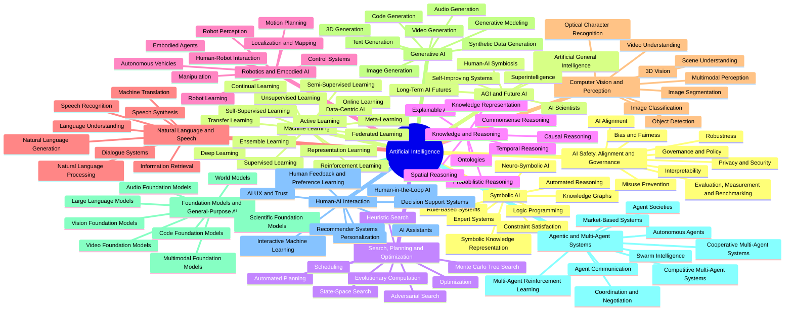

# AI Atlas Mermaid Mindmap

```mermaid
mindmap
  root((Artificial Intelligence))
    Symbolic AI
      Rule-Based Systems
      Expert Systems
      Logic Programming
      Symbolic Knowledge Representation
      Automated Reasoning
      Constraint Satisfaction
      Knowledge Graphs
      Neuro-Symbolic AI
    Machine Learning
      Supervised Learning
      Unsupervised Learning
      Semi-Supervised Learning
      Self-Supervised Learning
      Reinforcement Learning
      Deep Learning
      Representation Learning
      Transfer Learning
      Federated Learning
      Online Learning
      Active Learning
      Meta-Learning
      Ensemble Learning
      Continual Learning
      Data-Centric AI
    Search, Planning and Optimization
      State-Space Search
      Heuristic Search
      Adversarial Search
      Automated Planning
      Scheduling
      Optimization
      Evolutionary Computation
      Monte Carlo Tree Search
    Knowledge and Reasoning
      Commonsense Reasoning
      Probabilistic Reasoning
      Causal Reasoning
      Temporal Reasoning
      Spatial Reasoning
      Explainable AI
      Knowledge Representation
      Ontologies
    Robotics and Embodied AI
      Control Systems
      Robot Perception
      Localization and Mapping
      Motion Planning
      Manipulation
      Autonomous Vehicles
      Human-Robot Interaction
      Robot Learning
      Embodied Agents
    Natural Language and Speech
      Natural Language Processing
      Speech Recognition
      Speech Synthesis
      Dialogue Systems
      Information Retrieval
      Machine Translation
      Natural Language Generation
      Language Understanding
    Computer Vision and Perception
      Image Classification
      Object Detection
      Image Segmentation
      Video Understanding
      3D Vision
      Multimodal Perception
      Scene Understanding
      Optical Character Recognition
    Generative AI
      Text Generation
      Image Generation
      Audio Generation
      Video Generation
      Code Generation
      3D Generation
      Synthetic Data Generation
      Generative Modeling
    Foundation Models and General-Purpose AI
      Large Language Models
      Vision Foundation Models
      Multimodal Foundation Models
      Audio Foundation Models
      Video Foundation Models
      Code Foundation Models
      Scientific Foundation Models
      World Models
    Agentic and Multi-Agent Systems
      Autonomous Agents
      Cooperative Multi-Agent Systems
      Competitive Multi-Agent Systems
      Agent Communication
      Coordination and Negotiation
      Multi-Agent Reinforcement Learning
      Swarm Intelligence
      Agent Societies
      Market-Based Systems
    Human-AI Interaction
      AI Assistants
      Recommender Systems
      Human-in-the-Loop AI
      Interactive Machine Learning
      Personalization
      Decision Support Systems
      Human Feedback and Preference Learning
      AI UX and Trust
    AI Safety, Alignment and Governance
      AI Alignment
      Robustness
      Interpretability
      Evaluation, Measurement and Benchmarking
      Bias and Fairness
      Privacy and Security
      Misuse Prevention
      Governance and Policy
    AGI and Future AI
      Artificial General Intelligence
      Self-Improving Systems
      AI Scientists
      Human-AI Symbiosis
      Superintelligence
      Long-Term AI Futures
```
